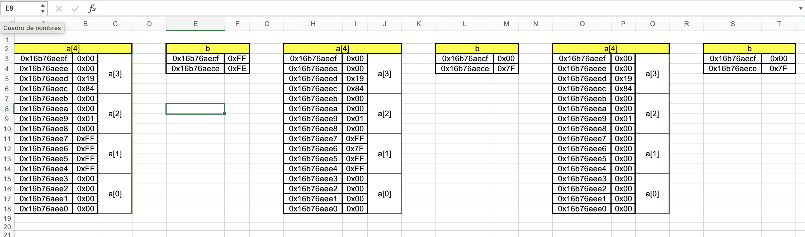

## Simple tool to generate a memory map in excel from variables

## Requirements
- libxl (https://libxl.com/)

## Example

Build the example
```console
$ make example
$ ./example
Saved to test.xls
```



This image represents the following code:
```c
#include <stdio.h>

#include "inspector.h"

int main(void) {

  inspector_t *inspector = inspector_create();
  if (inspector == NULL) {
    perror("inspector_create");
    return -1;
  }

  int a[4] = {0, -1, 0x100, 6532};
  short b = -2;

  inspect_arr(inspector, 4, a);
  inspect(inspector, &b);

  // instruccion 1
  b = *((char *)(a + 1) + 2) = 127;

  inspect_arr(inspector, 4, a);
  inspect(inspector, &b);

  // instruccion 2
  *(long long *)a = *((char *)&b + 1);

  inspect_arr(inspector, 4, a);
  inspect(inspector, &b);

  inspector_save(inspector, "test.xls");
  printf("Saved to test.xls\n");
  inspector_destroy(inspector);
  return 0;
}
```

### **This is not intended to be the safest tool in the world, it is just a tool to help you understand how your program works.**